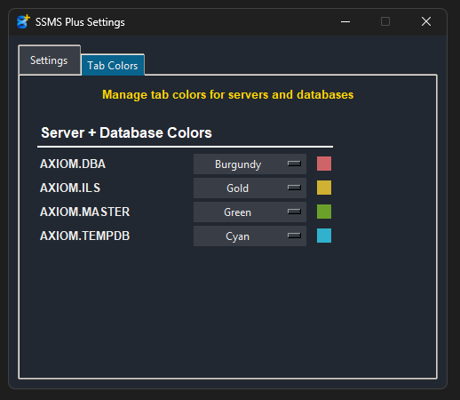

# SSMS Plus

Automatically organizes your SQL Server Management Studio files and colors tabs by server/database.

## What It Does

- **File Organization**: Automatically saves your SQL files in organized server/database folders
- **Tab Coloring**: Colors SSMS tabs by server or server+database for easy identification
- **Background Operation**: Runs silently in your system tray

## Setup

### 1. Enable SSMS Tab Coloring (Required)
In SSMS: **Tools** → **Options** → **Environment** → **Tabs and Windows** → Check **"Color tabs by regular expression"**

### 2. Configure SSMS Plus
- Run the app (appears in system tray)

- **Left-click** the tray icon to open settings
- Set your **Temp Directory** (click "Auto" for default)
- Set your **Save Directory** (where organized files go)
- Choose tab grouping mode (Server only or Server + Database)
- Configure tab colors in the "Tab Colors" tab
- Click **Save**

## Usage

Just use SSMS normally! SSMS Plus runs in the background and automatically organizes your files and colors your tabs.

**Important**: The first document you create after opening SSMS may not work correctly (wrong name and no coloring). Just ignore that first file - all subsequent files will work properly.

## Features

- **Automatic Updates**: Check for updates directly from the settings window
- **Tab Grouping Modes**: Color by server only or by server+database combinations
- **Customizable Colors**: Assign specific colors to each server or database

- **System Tray Integration**: Minimal interface that stays out of your way

## Troubleshooting

**Colors not working?** Make sure "Color tabs by regular expression" is enabled in SSMS Options.

**Files not organizing?** Verify the temp directory matches where SSMS creates files (right-click any SSMS tab → "Open Containing Folder").
